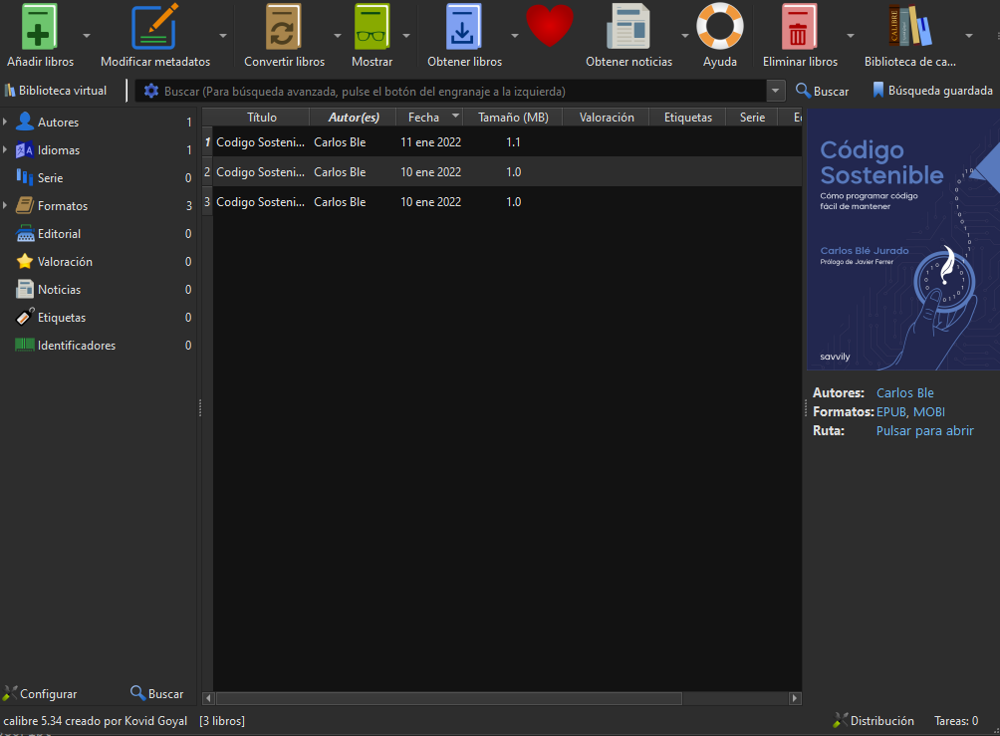
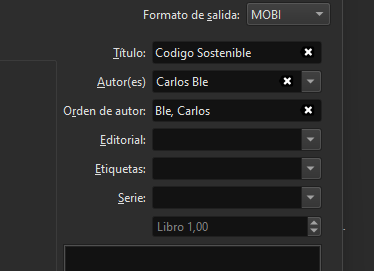

# Mobi

This is the file extension used by amazon kindle. *The process of generate this format
is not automatized.*

## Generate mobi

In order to generate mobi version it is necessary to download an external conversion software.
We recommend [Calibre](https://calibre-ebook.com/es/download).

Generate epub version with command `./convert -e <manuscript>`.

1. Open Calibre software.
2. Add the epub you want to convert to Mobi by pressing *Add Books* button.
3. Focus the epub you want to convert and press Convert Books button.

4. Select MOBI in the picker placed in top-right corner.

5. Press accept button to continue.
6. Result will be generated on `C:\Users\<User>\Calibre Library`

> Output folder may vary the name based on configuration language.
